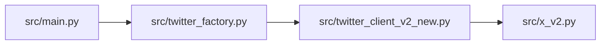
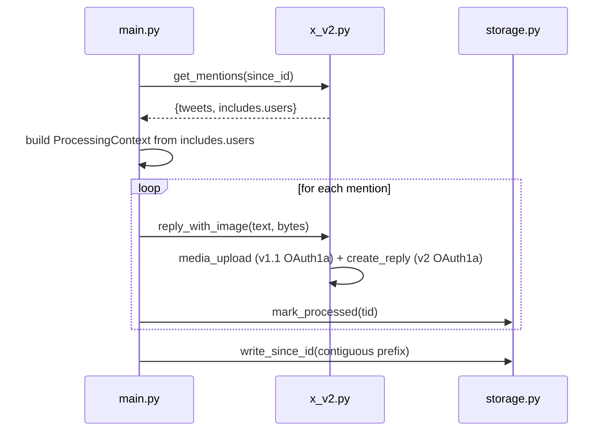
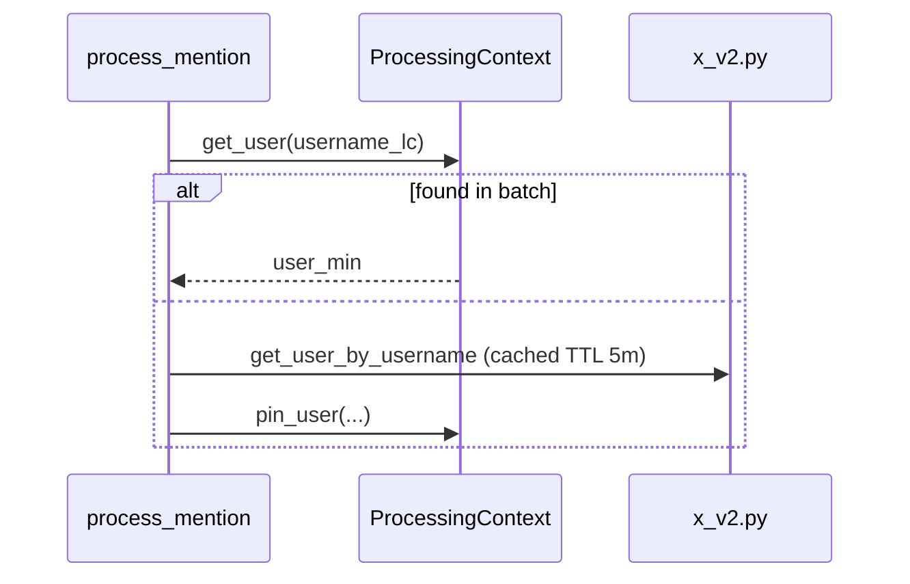
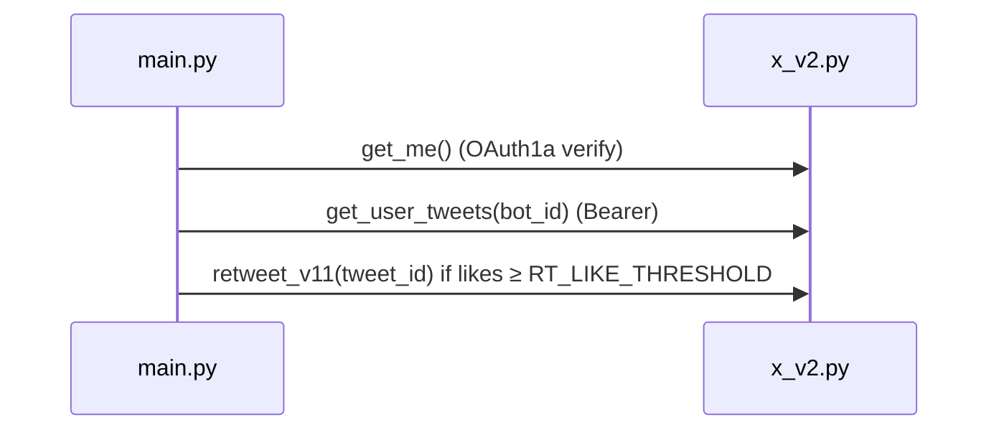

### CryBB — System & Code Architecture

### Import Chain



### Modules & Roles

| Path                           | Role                                                    | Key symbols                                                                                          |
| ------------------------------ | ------------------------------------------------------- | ---------------------------------------------------------------------------------------------------- |
| `src/main.py`                  | Bot runtime (polling, processing, sleeper RT)           | `process_mention`, `run_polling_loop`                                                                |
| `src/x_v2.py`                  | X API client (Bearer reads, OAuth1a writes, RL capture) | `get_mentions`, `media_upload`, `create_reply`, `reply_with_image`, `get_user_tweets`, `retweet_v11` |
| `src/twitter_client_v2_new.py` | Thin facade on `XAPIv2Client`                           | `TwitterClientV2New`                                                                                 |
| `src/twitter_factory.py`       | Client selection                                        | `make_twitter_client`                                                                                |
| `src/storage.py`               | Persistence for since_id and processed IDs              | `Storage`                                                                                            |
| `src/batch_context.py`         | Batch snapshot & pinning                                | `ProcessingContext`                                                                                  |
| `src/rate_limiter.py`          | Per-author limiter with whitelist bypass                | `RateLimiter`                                                                                        |
| `src/per_user_limiter.py`      | Per-target limiter (no whitelist bypass)                | `PerUserLimiter`                                                                                     |
| `src/server.py`                | Health server & metrics                                 | `app`, `update_metrics`                                                                              |

### Sequence: Mentions → Process → Upload → Reply



### Sequence: Batch Snapshot Resolution



### Sequence: Sleeper Retweet



### Where Rate-Limit Headers Are Captured & Used

- Capture:

```92:100:/Users/juliovivas/Vscode/crybb/src/x_v2.py
def _capture_rate_limits(self, response: requests.Response, endpoint: str) -> None:
    """Capture rate limit information from response headers."""
    try:
        limit = int(response.headers.get('x-rate-limit-limit', 0))
        remaining = int(response.headers.get('x-rate-limit-remaining', 0))
        reset = int(response.headers.get('x-rate-limit-reset', 0))
```

- Sleep when low remaining:

```125:133:/Users/juliovivas/Vscode/crybb/src/x_v2.py
def maybe_sleep(self, endpoint: str, min_remaining: int = 2) -> None:
    if endpoint not in self._rate_limits:
        return
    rate_info = self._rate_limits[endpoint]
    if rate_info.remaining < min_remaining:
        now = time.time()
        wait = max(0.0, rate_info.reset - now) + 5.0
```

### Logging & Metrics

- Health server endpoints and counters:

```23:31:/Users/juliovivas/Vscode/crybb/src/server.py
@app.get("/health")
async def health_check():
    """Health check endpoint for container orchestration."""
    return {
        "ok": True,
        "timestamp": datetime.utcnow().isoformat(),
```

- Metrics update from main:

```187:190:/Users/juliovivas/Vscode/crybb/src/main.py
from server import update_metrics
update_metrics(processed=1, replies_sent=1, last_mention_time=tweet_data.get('created_at'))
```
